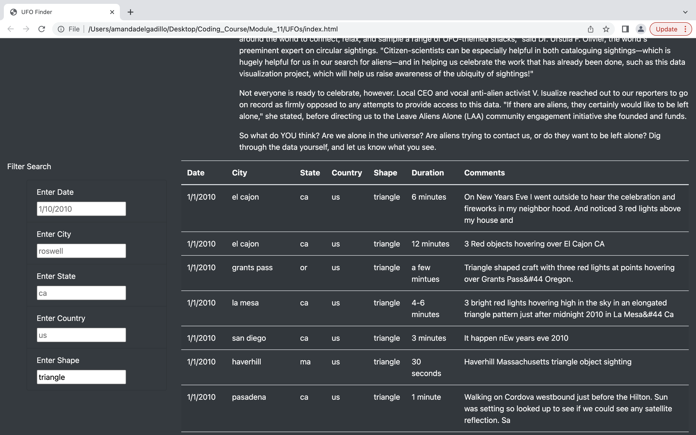

# UFOs
# Overview of the analysis:
The purpose of this challenge was to learn how to filter a dataset, compile the information in a table and display the results on a webpage using javaScript. Our dataset consists of many accounts of UFO sightings. In each row of data we observe the date of the sighting, the city, state and country where the incident occurred, the shape of the UFO, the duration of the incident, and a comment from the observer. 

# Results:
Using the filter search we can view data having a specific date, city, state, country, and shape. We can also apply multiple filters to the dataset. This allows us to view very specific accounts of UFO sightings. 
To utilize these filters we need to input text in the filter search and click ‘Enter’ on the keyboard, or simply click out of the input box. The results will be automatically generated on the table. 
In this first example we can see our table filtered to the shape ’triangle.’

In this second example we can see our table filtered on two fields; the state is filtered to ’tx’ and the date is filtered to ‘1/10/2010.’ 

# Summary:
To summarize, our result is a neatly organized webpage with data that can be easily filtered. Although the design is simple it serves its purpose and allows us to filter through a large dataset. 

There is one major draw back to this dataset; the units of measurement used in the ‘Duration’ column isn’t uniform for each row of data. If we ever wanted to filter our dataset further to observe the duration of UFO sighting incidents we would need to standardize our units of measurement for this field. It may be useful to do this because it’d allow us to observe how the duration of incidents differ between different types of UFOs, and how long they tend to linger in certain cities or states. 

One recommendation I would suggest to improve this webpage would be to expand the dataset to include different countries.
Our dataset contains only two UFO sightings from Canada and the remaining UFO sightings are recorded in the US. Including a more diverse dataset could provide greater insight into the topic. 
Lastly, I would suggest that we allow users to submit their own UFO sightings to be included in the dataset. This would provide us with a never-ending growing dataset to work with and analyze. 
